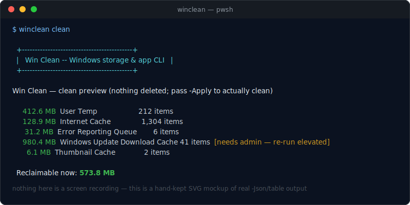
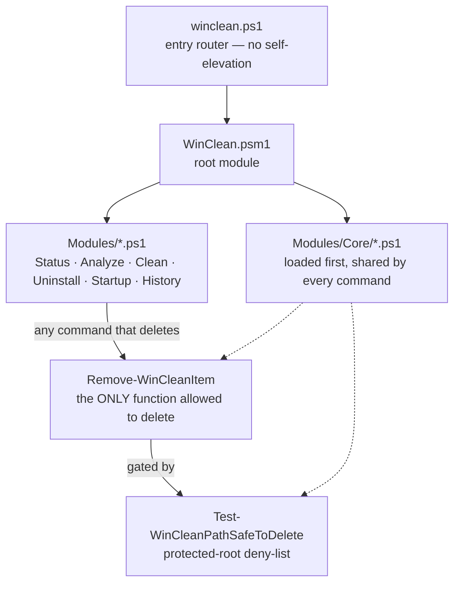
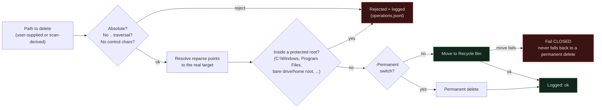

# 🧹 Win Clean

🧹 Clean, 🗑️ uninstall, 🔍 analyze, ⚡ optimize, and 📊 monitor your Windows
PC — all from the terminal.


A native PowerShell terminal CLI for Windows 10/11 storage analysis, cache
cleanup, app uninstall, and RAM diagnostics. No WSL, no extra runtime —
just PowerShell 5.1+ (ships with Windows) or PowerShell 7+.

**Contents:** [What it looks like](#what-it-looks-like) ·
[Commands](#commands) · [How it's built](#how-its-built) ·
[Safety model](#safety-model) · [Install](#install) · [Tests](#tests) ·
[Project layout](#project-layout) · [Status](#status)

## What it looks like 🖥️



That image is a hand-kept SVG, not a screen recording — there's no live
Windows box to capture a real one from (see [Status](#status): this
project is built and tested on macOS). It's redrawn by hand whenever the
real output format changes, rather than left to quietly drift like a
stale screenshot would. Every real invocation also prints a small banner
identifying the CLI, live — so this is genuinely representative, not a
polished-up approximation.

## Commands 🧰

| Command | What it does |
|---|---|
| `winclean status` | CPU/RAM/disk snapshot, top processes by memory. `-Close <pid>` / `-Restart <pid>` act on one; `-TrimWorkingSets` is an explicit, never-implicit, marginal RAM trim. |
| `winclean analyze` | Interactive disk browser, largest → smallest, drill-down + delete. `-Duplicates` finds exact-duplicate files by content hash (read-only). |
| `winclean clean` | Preview known-safe rebuildable storage; `-Apply` actually cleans it. `-IncludeDisabled` also covers opt-in-only entries (Prefetch, emptying the Recycle Bin). |
| `winclean uninstall` | List installed applications; `-Filter <text>` to search; `-Remove <index>` to uninstall one. |
| `winclean startup` | Read-only inventory of what launches at logon (registry Run keys + Startup folders). |
| `winclean history` | Read the JSON-lines operations log; `-Action`, `-Status`, `-Last <n>`, `-Json`. |

```
winclean status                     CPU/RAM/disk snapshot, top processes by memory (high -> low)
winclean status -Close <pid>        Close a specific process
winclean status -Restart <pid>      Restart a specific process (best effort)
winclean status -TrimWorkingSets    Marginal, explicitly opt-in RAM trim (not a "boost")

winclean analyze                    Interactive disk browser, largest -> smallest, drill-down + delete
winclean analyze -Path C:\Users\me  Scan a specific folder
winclean analyze -Json              Non-interactive JSON output
winclean analyze -Duplicates        Exact-duplicate files by content hash (read-only, reports only)

winclean clean                      Preview known-safe rebuildable storage (nothing deleted)
winclean clean -Apply               Actually clean it
winclean clean -IncludeDisabled     Also preview/apply opt-in-only entries: Prefetch, emptying
  -Apply                            the Recycle Bin — off by default, see Safety model below

winclean uninstall                  List installed applications
winclean uninstall -Filter Zoom     Search by name
winclean uninstall -Remove 3        Uninstall the app at that index

winclean startup                    Programs that launch at logon (registry Run keys + Startup
                                     folders) — read-only, nothing here disables or removes one

winclean history                    Past clean/uninstall/delete actions from the operations log
winclean history -Last 20           Most recent 20 entries
winclean history -Status rejected   Only entries Win Clean refused to act on
```

## How it's built 🏗️

Every command is a thin layer over one shared Core: nothing outside
`Modules/Core/` is allowed to touch the filesystem destructively.



`startup` and `history` never reach `Remove-WinCleanItem` at all — they're
read-only by design (see [Safety model](#safety-model)). Emptying the
Recycle Bin (`clean -IncludeDisabled -Apply`) is the one deliberate
exception on the other side: it calls the built-in `Clear-RecycleBin`
cmdlet directly, bypassing this gate entirely, because it takes no
caller-supplied path for the gate to check — explained in full below.

## Safety model 🛡️



Every delete goes through one function: `Remove-WinCleanItem`
(`Modules/Core/Remove-Safely.ps1`). It:

1. Validates the path (`Modules/Core/Safety.ps1`): must be absolute, no path
   traversal (`..`), no control characters, and — after resolving any
   symlink/junction to its real target — must not fall inside a protected
   root (`C:\Windows`, `C:\Program Files`, a bare drive root, a bare user
   home root, `System Volume Information`, etc.). A junction can't be used
   to walk a scan into a protected tree; resolution happens before the
   deny-list check runs.
2. Moves the item to the Recycle Bin by default. A failed Recycle Bin move
   **fails closed** — it never silently falls back to a permanent delete.
   `-Permanent` is required for a real, unrecoverable delete.
3. Logs every attempt (`%LOCALAPPDATA%\WinClean\logs\operations.jsonl`),
   independent of whatever the command printed to the console.

`winclean clean` previews by default; it only deletes with `-Apply`. This is
stricter than relying on PowerShell's own `-WhatIf`/`-Confirm` defaults,
which would otherwise proceed on a bare call for a command below the "High"
confirm-impact threshold.

`winclean uninstall` runs the *app's own* uninstaller (registry
`UninstallString` / `Remove-AppxPackage`) — it never hand-deletes an install
folder by guessing at a name or vendor. If a registry `InstallLocation`
still exists after a successful uninstall, Win Clean reports its path and
size and leaves deleting it to you via `winclean analyze`, rather than
guessing it's safe to remove automatically.

"Clean RAM" is intentionally not a headline feature: Windows manages its own
memory, and force-trimming a process's working set rarely frees anything
durable. `winclean status` shows real, actionable data (what's using memory,
sorted high to low) and lets you close/restart a specific process;
`-TrimWorkingSets` exists as a separate, clearly-labeled, never-implicit
option for anyone who wants it anyway.

Emptying the Recycle Bin (`clean -IncludeDisabled -Apply`) is the one
deliberate exception to "every delete goes through `Remove-WinCleanItem`":
it takes no path at all, so there's nothing for the path-safety gate to
check — it calls the same built-in Windows mechanism Explorer's own "Empty
Recycle Bin" uses. It's opt-in only and irreversible by definition (unlike
every other `clean` entry, which moves things *into* the Recycle Bin, this
one empties it), so it never runs without `-IncludeDisabled -Apply`
together. See `SECURITY.md` § Layer 3b for the full reasoning.

`startup` and `analyze -Duplicates` are read-only by design: which startup
entry is safe to disable, or which copy of a duplicate file is the one
worth keeping, is exactly the kind of per-item judgment call this project
doesn't automate — see `SECURITY.md` § Layer 5.

## Install 📦

```powershell
.\install.ps1
```

Copies Win Clean to `%LOCALAPPDATA%\Programs\WinClean` and adds it to your
user `PATH` (no admin rights required). Open a new terminal and run
`winclean help`.

To run without installing, from this folder:

```powershell
.\winclean.ps1 status
```

## Tests ✅

```powershell
Invoke-Pester .\Tests\
```

`Safety.Tests.ps1` and `RemoveSafely.Tests.ps1` cover the protected-path
deny-list and the delete/Recycle-Bin contract — the two things every other
command depends on.

## Project layout 🗂️

```
WinClean/
├── winclean.ps1                Entry router — see .NOTES in the file for a
│                                real PowerShell splatting gotcha it works around
├── winclean.cmd                 PATH shim so `winclean` works from cmd.exe too
├── WinClean.psd1 / .psm1         Module manifest / root module
├── Modules/
│   ├── Core/                     loaded first — every command depends on this
│   │   ├── Safety.ps1             Path validation + protected-root deny-list
│   │   ├── Remove-Safely.ps1      The ONLY function allowed to delete anything
│   │   ├── Logging.ps1            JSON-lines operations log
│   │   ├── Elevation.ps1          Admin check — never self-elevates
│   │   └── Format.ps1             Shared byte-size formatting
│   ├── Status.ps1                 RAM/CPU/disk snapshot, process actions
│   ├── Analyze.ps1                Disk usage scan, browser, duplicate-file finder
│   ├── Clean.ps1                  Known-safe cleanup catalog + Recycle Bin empty
│   ├── Uninstall.ps1              App inventory and removal
│   ├── Startup.ps1                Read-only startup-program inventory
│   └── History.ps1                Read-only operations-log viewer
├── Tests/                        Pester tests, one file per module
├── assets/                       README images (hand-kept SVGs, no external deps)
├── README.md                     This file
├── SECURITY.md                   Threat model and the delete/protected-path contract
└── CLAUDE.md                     Notes for future AI-agent work on this repo
```

## Status 📈

v0.1.0 — seven commands implemented and exercised for real: PowerShell 7
was installed locally (this project was built on macOS) and used to run the
full Pester suite (51 passing, 3 skipped — they need a real Windows Recycle
Bin / registry, guarded by `-Skip:(-not $IsWindows)`) plus manual end-to-end
CLI runs of every command. That process caught and fixed real bugs: a crash
in the protected-path builder when a Windows env var is unset, a `Join-Path`
gotcha with bare drive letters, an empty-string path hitting PowerShell's
own parameter binder instead of the safety check, a router bug where every
flag after the first was silently mis-parsed (see `winclean.ps1`), plus —
caught while adding `history`/`startup`/duplicate-finder/Recycle-Bin
support — `Test-WinCleanIsAdmin` throwing on non-Windows instead of
degrading to `$false`, the clean catalog crashing off-Windows because
`Join-Path` throws on *any* `"C:\..."`-shaped path (not just a bare drive
letter) when no matching PSDrive exists, and every `-Json` output path
silently printing nothing (or the literal string `"null"`) instead of `[]`
on a legitimately-empty result. Still needs one real pass on actual
Windows 10/11 hardware before you trust it against real data — nothing
here has run on a real Windows Recycle Bin, registry, or Appx store yet.
